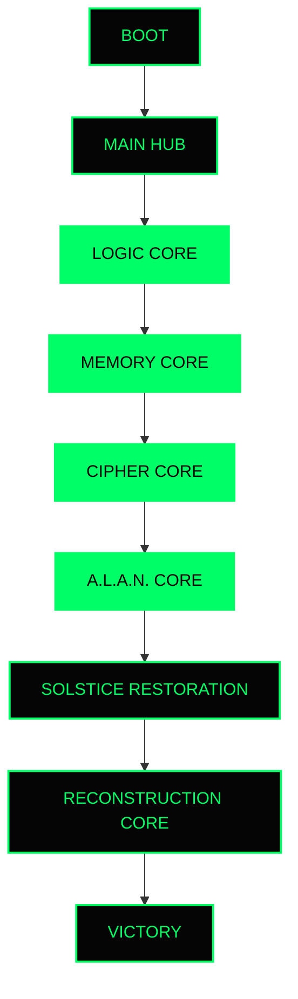

# SOLSTICE://TURING

<div align="center">
  <a href="https://solistice-turing-game.vercel.app/">
    
  </a>
</div>

<br />

> ***A retro-futuristic terminal puzzle adventure inspired by the June Solstice, Alan Turing, digital logic, memory reconstruction, and cryptography.***

---

## 📖 About the June Solstice Game Jam

The June Solstice Game Jam is hosted by the DEV Community.

The challenge is to build a game inspired by:
* June Solstice
* Light and Darkness
* Passage of Time
* Pride Month
* Juneteenth
* Alan Turing
* Computing History

**How this project interprets the theme:**
`SOLSTICE://TURING` embraces the juxtaposition of light and darkness inherent in the June Solstice. Players journey from a state of total system corruption (darkness) towards 100% Light Restoration. Along the way, the game honors Alan Turing—celebrating his contributions to computing and codebreaking, while acknowledging his legacy during Pride Month.

---

## 🎯 Project Overview

The Solstice System has suffered catastrophic corruption.

An ancient digital intelligence known as A.L.A.N. (Adaptive Logic Analysis Network) awakens the player and assigns a critical mission:

1. Restore the Logic Core.
2. Recover the Memory Core.
3. Decrypt the Cipher Core.
4. Reactivate the A.L.A.N. Core.

Only after restoring all systems can the player reconstruct Alan Turing's archive and bring light back to the Solstice Network.

---

## ✨ Key Features

### Global Systems
* Solstice Meter
* Corruption Level
* Dynamic System Logs
* Save Progress using Local Storage
* System Reset Functionality

### Logic Core
* Binary Logic Reconstruction
* AND Gate Challenges
* OR Gate Challenges
* XOR Gate Challenges
* NAND/NOR/XNOR Challenges
* Multi-Level Progression
* Logic Core Health System

### Memory Core
* Binary Sequence Recall
* Archive Recovery Missions
* Increasing Difficulty Levels
* Memory Health System

### Cipher Core
* Caesar Cipher Challenges
* Binary Translation Challenges
* Turing-Inspired Decryption Puzzles
* Archive Restoration System

### A.L.A.N. Core
* Interactive Terminal Assistance
* Dynamic Hint System
* Tutorial System
* Context-Aware Guidance

### Reconstruction Core
* Final Restoration Sequence
* Solstice Completion Event

---

## 🧠 Meet A.L.A.N.

**Adaptive Logic Analysis Network**

A.L.A.N. serves as the player's primary guide throughout the game. 

**Responsibilities:**
* Tutorials
* Hints
* System Warnings
* Turing Archive Narration
* Restoration Progress Updates

---

## 🗺️ Gameplay Flow



---

## ⚖️ Solstice Meter & Corruption Level

**Solstice Meter:**
Represents Light Restoration.
Increases as modules are completed.
Unlocks the Reconstruction Core at 100%.

**Corruption Level:**
Represents system instability.
Changes according to player actions.
Triggers warning events and terminal effects.

---

## 🗄️ Turing Archive System

Players unlock historical facts about Alan Turing while progressing through the game.

Topics include:
* Enigma Machine
* Turing Test
* Computing History

---

## 💻 Tech Stack

| Technology | Badge | Description |
| :--- | :--- | :--- |
| **React** |  | UI Framework |
| **Vite** |  | Build Tool |
| **Tailwind CSS** |  | Styling & UI |
| **Anime.js** |  | Complex Animations |
| **React Context** |  | State Management |
| **Local Storage** |  | Persistent Data |
| **Vercel** |  | Deployment |

---

## 📁 Folder Structure

```text
june-solistice/
├── public/                # Static assets
├── src/
│   ├── components/        # Reusable UI components (SystemSidebar, AiTerminal, etc.)
│   ├── context/           # GameContext for global state management
│   ├── data/              # Static game data, puzzles, and hints
│   ├── screens/           # Core modules and views (MainHub, MemoryCore, etc.)
│   ├── App.jsx            # Main application wrapper and theme controller
│   ├── index.css          # Global Tailwind and terminal CSS
│   └── main.jsx           # React entry point
└── tailwind.config.js     # Tailwind configurations and custom colors
```

---

## 🚀 Installation

```bash
git clone <YOUR_REPO_URL>
cd june-solistice
npm install
npm run dev
```

To build for production:
```bash
npm run build
npm run preview
```

---

## 🎮 How To Play

**Step 1:** Launch the game via the live link.  
**Step 2:** Complete Logic Core puzzles.  
**Step 3:** Restore Memory Core archives.  
**Step 4:** Decode Cipher Core messages.  
**Step 5:** Use A.L.A.N. for hints.  
**Step 6:** Reach 100% Solstice Restoration.  
**Step 7:** Unlock Reconstruction Core.  
**Step 8:** Restore the Solstice Network.  

---

## 📸 Screenshots

*Main Hub*  


*Logic Core*  


*Memory Core*  


*Cipher Core*  


*A.L.A.N. Core*  


*Reconstruction Core*  


*Victory Screen*  


---

## 🔮 Future Enhancements

* Additional Cipher Types
* Multiplayer Challenges
* Global Leaderboard
* More Alan Turing Archives
* Procedural Puzzle Generation
* Voice Narration by A.L.A.N.

---

## 🏆 Credits

Developed for the **June Solstice Game Jam** by the DEV Community.

Inspired by:
* Alan Turing
* Computing History
* June Solstice

---

## 📄 License

This project is licensed under the MIT License.

---

Light Restored.  
Corruption Eliminated.  
Archive Complete.  

**SOLSTICE://TURING**
